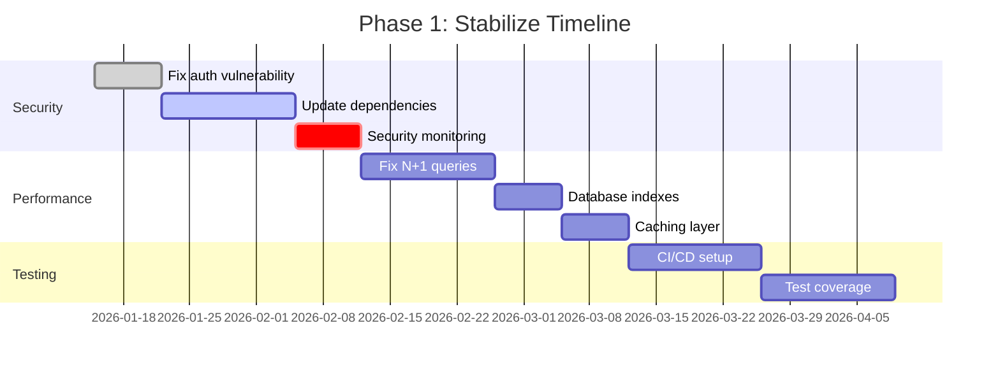

# Legacy Codebase Analysis Deliverable Templates

Professional templates and guidelines for communicating technical debt assessment findings, recommendations, and roadmaps to diverse stakeholder audiences. These templates ensure consistent, actionable, and audience-appropriate documentation.

---

## Table of Contents

- [Executive Summary Template](#executive-summary-template)
- [Technical Debt Report Template](#technical-debt-report-template)
- [Modernization Roadmap Template](#modernization-roadmap-template)
- [Presentation Templates](#presentation-templates)
- [Report Writing Guidelines](#report-writing-guidelines)

---

## Executive Summary Template

**Purpose:** One-page overview for executive stakeholders who need to make funding and strategic decisions.

**Audience:** C-level executives, board members, investors, non-technical stakeholders

**Format:** Single page (max 500 words)

**Delivery:** PDF, PowerPoint slide, or email

---

### Template Structure

```markdown
# Executive Summary: [System Name] Technical Assessment

**Date:** [Assessment Date]
**Prepared by:** [Team/Consultant Name]
**Executive Sponsor:** [Sponsor Name]

---

## Overview

[System Name] is a [age]-year-old [type of system] serving [number] users/customers and generating $[revenue] annually. This assessment evaluates the technical health of the system and identifies critical modernization needs.

**Assessment Period:** [Start Date] - [End Date]
**Methodology:** Automated analysis, manual code review, stakeholder interviews, performance profiling

---

## Key Findings

### Overall Health Score: [Score]/100 ([Rating])

**Rating Scale:** 85-100 (Excellent) | 70-84 (Good) | 50-69 (Fair) | 30-49 (Poor) | 0-29 (Critical)

### Critical Issues (Must Address)

1. **[Issue Name]** - [One sentence description]
   - **Impact:** [Business impact in plain language]
   - **Risk:** [What could happen if not addressed]

2. **[Issue Name]** - [One sentence description]
   - **Impact:** [Business impact]
   - **Risk:** [What could happen]

3. **[Issue Name]** - [One sentence description]
   - **Impact:** [Business impact]
   - **Risk:** [What could happen]

---

## Business Impact

### Current State Costs
- **Lost Revenue:** $[amount]/year from [specific cause]
- **Excess Infrastructure:** $[amount]/year in over-provisioned resources
- **Support Burden:** $[amount]/year in manual workarounds
- **Opportunity Cost:** $[amount]/year in delayed features
- **Total Annual Impact:** $[total]/year

### Risk Exposure
- **Security Vulnerabilities:** [number] critical, [number] high severity
- **Compliance Gaps:** [list regulations at risk]
- **Estimated Breach Cost:** $[amount] (industry average for similar systems)
- **Business Continuity Risk:** [description of operational risks]

---

## Recommended Action

### Proposed Investment
- **Total Cost:** $[amount]
- **Timeline:** [duration] months
- **Team:** [number] engineers, [FTE commitment]

### Expected Return
- **Annual Savings:** $[amount]/year
- **Revenue Opportunity:** $[amount]/year
- **Risk Reduction:** $[amount] (avoided costs)
- **ROI:** [percentage]% in Year 1
- **Payback Period:** [months] months

### Phased Approach
1. **Phase 1 (Months 1-[X]):** Stabilize - Address critical security and performance issues
2. **Phase 2 (Months [X]-[Y]):** Modernize - Update core technologies and architecture
3. **Phase 3 (Months [Y]-[Z]):** Optimize - Enable scalability and improve developer experience

---

## Decision Required

**Recommended Path Forward:** [Clear recommendation - e.g., "Approve $660K investment for 18-month modernization"]

**Alternative Options:**
- **Option A:** Full modernization [$amount, timeline]
- **Option B:** Minimal stabilization [$amount, timeline]
- **Option C:** System replacement [$amount, timeline]

**Next Steps:**
1. [Specific next action - e.g., "Approve budget allocation"]
2. [Second action - e.g., "Form modernization steering committee"]
3. [Third action - e.g., "Begin Phase 1 planning"]

---

## Risks of Inaction

- **Short-term (0-6 months):** [Immediate consequences]
- **Medium-term (6-18 months):** [Escalating problems]
- **Long-term (18+ months):** [Potential catastrophic outcomes]

**Bottom Line:** [One sentence summarizing the urgency and importance]

---

**Contact for Questions:** [Name, Title, Email, Phone]
**Full Technical Report:** [Link or attachment reference]
```

---

### Example Executive Summary

```markdown
# Executive Summary: E-Commerce Platform Technical Assessment

**Date:** December 13, 2025
**Prepared by:** Engineering Leadership Team
**Executive Sponsor:** Sarah Chen, CTO

---

## Overview

The e-commerce platform is an 8-year-old web application serving 500K active users and generating $25M annually. This assessment evaluates the technical health of the system and identifies critical modernization needs.

**Assessment Period:** November 1 - December 13, 2025
**Methodology:** Automated analysis, manual code review, 12 stakeholder interviews, performance profiling

---

## Key Findings

### Overall Health Score: 52/100 (Fair)

### Critical Issues (Must Address)

1. **Authentication Vulnerability** - SQL injection allows unauthorized account access
   - **Impact:** All user accounts at risk of compromise
   - **Risk:** Data breach, regulatory fines up to $2.5M, reputational damage

2. **Performance Degradation** - Page load times 8-12 seconds during peak hours
   - **Impact:** 35% cart abandonment rate, $200K/year lost revenue
   - **Risk:** Increasing customer frustration, competitive disadvantage

3. **Python 2.7 End-of-Life** - Running on unsupported Python version (EOL since 2020)
   - **Impact:** No security patches, incompatible with modern libraries
   - **Risk:** Increasing vulnerability to exploits, unable to hire Python 2 developers

---

## Business Impact

### Current State Costs
- **Lost Revenue:** $200K/year from slow page loads and cart abandonment
- **Excess Infrastructure:** $75K/year over-provisioned servers compensating for inefficiencies
- **Support Burden:** $100K/year manual workarounds for system limitations
- **Opportunity Cost:** $125K/year delayed features (6-month slower time-to-market)
- **Total Annual Impact:** $500K/year

### Risk Exposure
- **Security Vulnerabilities:** 3 critical, 12 high severity (CVSS scores 7.0+)
- **Compliance Gaps:** GDPR, SOC 2, PCI-DSS compliance at risk
- **Estimated Breach Cost:** $2.5M (Ponemon Institute average for companies our size)
- **Business Continuity Risk:** Single point of failure in payment processing, no disaster recovery plan

---

## Recommended Action

### Proposed Investment
- **Total Cost:** $660K
- **Timeline:** 18 months
- **Team:** 4 engineers (full-time dedication)

### Expected Return
- **Annual Savings:** $175K/year (infrastructure optimization, reduced support burden)
- **Revenue Opportunity:** $450K/year (improved conversion, faster feature delivery)
- **Risk Reduction:** $2.5M (avoided breach costs, risk-adjusted to $700K)
- **ROI:** 101% in Year 1
- **Payback Period:** 7 months

### Phased Approach
1. **Phase 1 (Months 1-3):** Stabilize - Fix authentication vulnerability, improve page load times to <2 seconds, establish testing infrastructure
2. **Phase 2 (Months 4-9):** Modernize - Migrate to Python 3.11, upgrade Django framework, refactor architecture for maintainability
3. **Phase 3 (Months 10-18):** Optimize - Enable horizontal scaling, improve developer experience, implement comprehensive observability

---

## Decision Required

**Recommended Path Forward:** Approve $660K investment for 18-month phased modernization program

**Alternative Options:**
- **Option A:** Full modernization [$660K, 18 months] - Comprehensive transformation (recommended)
- **Option B:** Minimal stabilization [$150K, 3 months] - Address only critical security and performance issues, defer architectural improvements
- **Option C:** System replacement [$2M, 24 months] - Complete rewrite (not recommended due to high risk and cost)

**Next Steps:**
1. Approve FY26 budget allocation ($660K over 18 months)
2. Form modernization steering committee (CTO, VP Engineering, Product Lead)
3. Begin Phase 1 planning and team allocation (target start: January 15, 2026)

---

## Risks of Inaction

- **Short-term (0-6 months):** Continued revenue loss ($100K+), increasing customer complaints, growing security vulnerability surface
- **Medium-term (6-18 months):** Unable to compete with faster-moving competitors, technical talent leaving due to legacy technology stack, potential security incident
- **Long-term (18+ months):** System becomes unmaintainable, forced emergency rewrite at 3x cost, potential business failure if security breach occurs

**Bottom Line:** The platform is operational but increasingly risky and costly. Strategic modernization investment will eliminate critical vulnerabilities, unlock revenue growth, and position the business for long-term success.

---

**Contact for Questions:** Alex Martinez, VP Engineering | alex.martinez@company.com | (555) 123-4567
**Full Technical Report:** See attached 47-page technical assessment (PDF)
```

---

## Technical Debt Report Template

**Purpose:** Comprehensive technical analysis with detailed findings, evidence, and recommendations.

**Audience:** Engineering leadership, architects, senior engineers, technical stakeholders

**Format:** 20-50 page document (PDF or Confluence)

**Delivery:** Written report with appendices

---

### Template Structure

```markdown
# Technical Debt Assessment: [System Name]

**Version:** 1.0
**Date:** [Date]
**Prepared by:** [Team/Names]
**Reviewed by:** [Reviewers]
**Classification:** [Internal/Confidential]

---

## Document Control

| Version | Date | Author | Changes |
|---------|------|--------|---------|
| 1.0 | [Date] | [Name] | Initial release |

---

## Table of Contents

1. Executive Summary
2. Assessment Methodology
3. System Overview
4. Findings and Analysis
5. Prioritized Recommendations
6. Implementation Roadmap
7. Risk Assessment
8. Cost-Benefit Analysis
9. Appendices

---

## 1. Executive Summary

[Include one-page executive summary here - see previous section]

---

## 2. Assessment Methodology

### 2.1 Scope

**In Scope:**
- [List systems, components, repositories assessed]
- [Time period of analysis]
- [Specific areas of focus]

**Out of Scope:**
- [Explicitly state what was NOT assessed]
- [Rationale for scope boundaries]

### 2.2 Assessment Approach

**Automated Analysis:**
- Code quality scanning (tools: [list tools used])
- Security vulnerability scanning (tools: [list tools])
- Dependency analysis (tools: [list tools])
- Performance profiling (tools: [list tools])
- Test coverage analysis (tools: [list tools])

**Manual Analysis:**
- Code review of [X] critical modules
- Architecture documentation and review
- Database schema analysis
- API and integration point review

**Stakeholder Engagement:**
- [Number] interviews conducted
- Roles interviewed: [list roles]
- Survey responses: [number]

**Performance Testing:**
- Load testing methodology
- Test scenarios and environments
- Performance benchmarks

### 2.3 Scoring Framework

[Describe the scoring system used]

**Overall Health Score (0-100):**
- 85-100: Excellent - Minimal technical debt
- 70-84: Good - Manageable technical debt
- 50-69: Fair - Significant technical debt requiring attention
- 30-49: Poor - Critical technical debt impacting business
- 0-29: Critical - System at risk of failure

**Component Scores:**
- Code Quality (0-100)
- Security (0-100)
- Performance (0-100)
- Architecture (0-100)
- Maintainability (0-100)
- Test Coverage (0-100)

### 2.4 Assessment Timeline

- **Kickoff:** [Date]
- **Data Collection:** [Date Range]
- **Analysis:** [Date Range]
- **Report Drafting:** [Date Range]
- **Review and Finalization:** [Date Range]
- **Delivery:** [Date]

---

## 3. System Overview

### 3.1 System Description

**Business Purpose:**
[Description of what the system does and its business value]

**Key Capabilities:**
- [Capability 1]
- [Capability 2]
- [Capability 3]

**Users and Scale:**
- Active users: [number]
- Transactions/day: [number]
- Data volume: [size]
- Uptime requirement: [percentage]

### 3.2 Technology Stack

**Programming Languages:**
- [Language 1]: [Version] ([percentage]% of codebase)
- [Language 2]: [Version] ([percentage]% of codebase)

**Frameworks:**
- [Framework 1]: [Version]
- [Framework 2]: [Version]

**Databases:**
- [Database 1]: [Version]
- [Database 2]: [Version]

**Infrastructure:**
- Hosting: [Provider/Platform]
- Deployment: [Method/Tools]
- Monitoring: [Tools]

**Key Dependencies:**
[Table of critical third-party dependencies with versions and EOL status]

| Dependency | Version | Latest Version | EOL Date | Status |
|------------|---------|----------------|----------|--------|
| Python | 2.7.18 | 3.12.0 | 2020-01-01 | EOL |
| Django | 1.11.29 | 5.0.0 | 2020-04-01 | EOL |

### 3.3 Codebase Metrics

**Size:**
- Total lines of code: [number]
- Number of files: [number]
- Number of modules/packages: [number]

**Age and Activity:**
- Repository age: [years] years
- First commit: [date]
- Last commit: [date]
- Active contributors (last 12 months): [number]
- Total contributors (all time): [number]
- Average commits per month: [number]

**Code Distribution:**
[Chart or table showing code distribution by language, module, or functionality]

### 3.4 Architecture Overview

[Architecture diagram showing major components, data flows, and integration points]

**Architecture Style:** [e.g., Monolithic, Microservices, Layered, Event-Driven]

**Key Components:**
1. **[Component Name]** - [Description and responsibility]
2. **[Component Name]** - [Description and responsibility]
3. **[Component Name]** - [Description and responsibility]

**Integration Points:**
- [External System 1]: [Integration method]
- [External System 2]: [Integration method]

---

## 4. Findings and Analysis

### 4.1 Overall Assessment Summary

**Overall Health Score: [Score]/100 ([Rating])**

| Category | Score | Rating | Priority |
|----------|-------|--------|----------|
| Code Quality | [Score]/100 | [Rating] | [High/Medium/Low] |
| Security | [Score]/100 | [Rating] | [High/Medium/Low] |
| Performance | [Score]/100 | [Rating] | [High/Medium/Low] |
| Architecture | [Score]/100 | [Rating] | [High/Medium/Low] |
| Maintainability | [Score]/100 | [Rating] | [High/Medium/Low] |
| Test Coverage | [Score]/100 | [Rating] | [High/Medium/Low] |

**Key Takeaways:**
- [3-5 bullet points summarizing most important findings]

### 4.2 Code Quality Analysis

**Score: [Score]/100 ([Rating])**

#### 4.2.1 Complexity Analysis

**Cyclomatic Complexity:**
- Average: [number] (target: <10)
- Maximum: [number]
- Functions with complexity >20: [number]

**Top Complex Functions:**

| Function | File | Complexity | Lines | Priority |
|----------|------|------------|-------|----------|
| [Function] | [Path] | [Number] | [Number] | Critical |
| [Function] | [Path] | [Number] | [Number] | High |

**Recommendation:** Refactor functions with complexity >15 using Extract Method pattern.

#### 4.2.2 Code Duplication

**Duplication Rate: [percentage]%** (target: <5%)

**Duplicated Code Blocks:** [number]

**Most Duplicated Code:**

| Code Block | Locations | Lines | Impact |
|------------|-----------|-------|--------|
| [Description] | [Files] | [Number] | [High/Medium/Low] |

**Recommendation:** Extract duplicated code into shared utilities.

#### 4.2.3 Code Smells

**Total Code Smells: [number]**

| Type | Count | Examples |
|------|-------|----------|
| Long Methods (>50 lines) | [number] | [File:line] |
| Large Classes (>500 lines) | [number] | [File:line] |
| Complex Conditionals | [number] | [File:line] |
| God Objects | [number] | [File:line] |

#### 4.2.4 Linting Violations

**Total Violations: [number]**

| Severity | Count | Top Issues |
|----------|-------|------------|
| Critical | [number] | [Issue type] |
| High | [number] | [Issue type] |
| Medium | [number] | [Issue type] |
| Low | [number] | [Issue type] |

### 4.3 Security Analysis

**Score: [Score]/100 ([Rating])**

#### 4.3.1 Vulnerability Summary

**Total Vulnerabilities: [number]**

| Severity | Count | CVSS Range |
|----------|-------|------------|
| Critical (CVSS 9.0-10.0) | [number] | [list CVEs] |
| High (CVSS 7.0-8.9) | [number] | [list CVEs] |
| Medium (CVSS 4.0-6.9) | [number] | [summary] |
| Low (CVSS 0.1-3.9) | [number] | [summary] |

#### 4.3.2 Critical Security Findings

**Finding 1: [Vulnerability Name]**

**Severity:** Critical (CVSS [score])
**Category:** [e.g., Injection, Broken Authentication]
**CVE:** [CVE-YYYY-XXXXX] (if applicable)

**Description:**
[Clear explanation of the vulnerability]

**Location:**
- File: [path/to/file.py]
- Lines: [line numbers]
- Affected endpoints: [list]

**Proof of Concept:**
```python
# Code demonstrating the vulnerability
payload = "admin' OR '1'='1' --"
# Results in authentication bypass
```

**Impact:**
- **Confidentiality:** [High/Medium/Low] - [Description]
- **Integrity:** [High/Medium/Low] - [Description]
- **Availability:** [High/Medium/Low] - [Description]
- **Business Impact:** [Description]

**Affected Systems:**
- Production environment
- Staging environment
- [Other environments]

**Remediation:**
1. **Immediate Action:** [Quick fix or mitigation]
2. **Short-term (1-2 weeks):** [Proper fix]
3. **Long-term (1-3 months):** [Systemic improvements]

**Remediation Code:**
```python
# Before (vulnerable)
query = f"SELECT * FROM users WHERE username='{username}'"

# After (secure)
query = "SELECT * FROM users WHERE username=%s"
cursor.execute(query, (username,))
```

**Verification:**
- [ ] Unit test added for exploit attempt
- [ ] Manual penetration test confirms fix
- [ ] Code review completed
- [ ] Security scan shows no vulnerability

---

[Repeat for additional critical/high security findings]

#### 4.3.3 Dependency Vulnerabilities

**Total Vulnerable Dependencies: [number]**

| Dependency | Version | Vulnerability | CVSS | Fix Version |
|------------|---------|---------------|------|-------------|
| [Package] | [X.Y.Z] | [CVE-YYYY-XXXXX] | [Score] | [X.Y.Z] |

**Recommendation:** Upgrade all dependencies with known vulnerabilities. Priority: Critical > High > Medium > Low.

### 4.4 Performance Analysis

**Score: [Score]/100 ([Rating])**

#### 4.4.1 Response Time Analysis

**Current Performance:**
- p50 (Median): [number]ms
- p95: [number]ms (target: <500ms)
- p99: [number]ms
- p99.9: [number]ms

**Performance by Endpoint:**

| Endpoint | p50 | p95 | p99 | Target | Status |
|----------|-----|-----|-----|--------|--------|
| GET /api/users | [X]ms | [Y]ms | [Z]ms | <200ms | ❌ Slow |
| POST /api/orders | [X]ms | [Y]ms | [Z]ms | <500ms | ✅ Good |

#### 4.4.2 Performance Bottlenecks

**Bottleneck 1: N+1 Query Problem in User Dashboard**

**Severity:** High
**Impact:** 40% of user sessions experience >5 second page loads

**Root Cause:**
- Inefficient ORM usage generates 150+ database queries per page load
- Missing database indexes on frequently queried columns
- No query caching

**Evidence:**
```sql
-- Slow query log excerpt (repeated 50 times)
SELECT * FROM orders WHERE user_id = 123;  -- 120ms each
SELECT * FROM products WHERE id = 456;     -- 80ms each (repeated 100 times)
-- Total query time: 6.2 seconds
```

**Business Impact:**
- 35% bounce rate on dashboard page
- Estimated $50K/month in lost revenue from abandoned sessions
- Poor user experience (NPS score 6.2/10)

**Proposed Solution:**
1. **Immediate (2 hours):** Add database indexes
   ```sql
   CREATE INDEX idx_orders_user_id ON orders(user_id);
   CREATE INDEX idx_products_id ON products(id);
   ```

2. **Short-term (1 week):** Optimize queries with eager loading
   ```python
   # Before: N+1 queries
   orders = Order.objects.filter(user=user)
   for order in orders:
       product = order.product  # Separate query for each

   # After: 2 queries total
   orders = Order.objects.filter(user=user).select_related('product')
   ```

3. **Long-term (1 month):** Implement caching layer (Redis)

**Expected Improvement:**
- Page load time: 8-12s → 1-2s (80-90% improvement)
- Database load: 150 queries → 3 queries (98% reduction)
- Server cost reduction: 40% (better resource utilization)

---

[Repeat for additional performance bottlenecks]

#### 4.4.3 Resource Utilization

**CPU:**
- Average: [percentage]%
- Peak: [percentage]%
- Status: [Normal/High/Critical]

**Memory:**
- Average: [GB]
- Peak: [GB]
- Memory leaks detected: [Yes/No]

**Database:**
- Query response time avg: [ms]
- Connection pool utilization: [percentage]%
- Slow queries (>1s): [number]

**Recommendation:** [Summary of resource optimization opportunities]

### 4.5 Architecture Analysis

**Score: [Score]/100 ([Rating])**

#### 4.5.1 Architecture Health Assessment

**Current Architecture Pattern:** [e.g., Monolithic, Layered]

**Strengths:**
- [Strength 1]
- [Strength 2]

**Weaknesses:**
- [Weakness 1]
- [Weakness 2]

**Architecture Debt Hotspots:**

1. **Monolithic Database Access Pattern**

**Location:** Throughout application (183 files)

**Issue:** Database queries scattered across application layers
- UI components directly query database
- Business logic mixed with data access
- No abstraction layer or repository pattern

**Impact:**
- Difficult to change database schema
- Impossible to add caching without widespread refactoring
- Testing requires full database setup
- Cannot scale database independently

**Effort to Fix:** 3-4 months (estimated 800 hours)

**Recommendation:** Implement Repository pattern and Data Access Layer

#### 4.5.2 Component Coupling Analysis

**Coupling Metrics:**

| Component | Afferent Coupling (Ca) | Efferent Coupling (Ce) | Instability (I) | Status |
|-----------|------------------------|------------------------|-----------------|--------|
| [Component] | [number] | [number] | [0.0-1.0] | [Good/Poor] |

**Circular Dependencies Detected:** [number]

[Dependency graph showing circular dependencies]

**Recommendation:** Break circular dependencies by introducing interfaces and dependency injection.

#### 4.5.3 Separation of Concerns

**Violations Found:** [number]

| Violation Type | Count | Example Location |
|----------------|-------|------------------|
| Business logic in presentation layer | [X] | [file:line] |
| Database queries in UI code | [Y] | [file:line] |
| Mixed responsibilities in classes | [Z] | [file:line] |

### 4.6 Maintainability Analysis

**Score: [Score]/100 ([Rating])**

#### 4.6.1 Test Coverage

**Overall Test Coverage: [percentage]%** (target: 80%)

**Coverage by Type:**
- Unit tests: [percentage]%
- Integration tests: [percentage]%
- End-to-end tests: [percentage]%
- Critical path coverage: [percentage]%

**Untested Critical Components:**
- [Component 1]: 0% coverage
- [Component 2]: 15% coverage

**Recommendation:** Prioritize testing for authentication, payment processing, and data access layers.

#### 4.6.2 Documentation Quality

**Documentation Coverage: [percentage]%**

| Documentation Type | Status | Completeness |
|--------------------|--------|--------------|
| README | [Good/Fair/Poor] | [percentage]% |
| API Documentation | [Good/Fair/Poor] | [percentage]% |
| Architecture Docs | [Good/Fair/Poor] | [percentage]% |
| Deployment Runbooks | [Good/Fair/Poor] | [percentage]% |
| Code Comments | [Good/Fair/Poor] | [percentage]% |

**Critical Missing Documentation:**
- [Item 1]
- [Item 2]

#### 4.6.3 Developer Experience

**Developer Feedback Summary:**
[Summary of developer interviews and surveys]

**Pain Points:**
- [Pain point 1]: [percentage]% of developers mentioned
- [Pain point 2]: [percentage]% of developers mentioned

**Development Velocity:**
- Average feature development time: [duration]
- Time spent on bug fixes: [percentage]% of development time
- Deployment frequency: [frequency]

---

## 5. Prioritized Recommendations

### 5.1 Critical Priority (Do Immediately)

**Total Items:** [number]
**Estimated Effort:** [person-weeks]
**Expected Timeline:** [weeks]

#### Recommendation 1: [Title]

**Priority:** Critical
**Category:** [Security/Performance/Quality]
**Effort:** [person-weeks]
**Impact:** [High/Medium/Low]
**RICE Score:** [number]

**Problem Statement:**
[Clear description of the issue]

**Recommended Solution:**
[Specific, actionable steps to address the issue]

**Expected Benefits:**
- [Benefit 1]
- [Benefit 2]

**Implementation Steps:**
1. [Step 1] - [duration]
2. [Step 2] - [duration]
3. [Step 3] - [duration]

**Success Criteria:**
- [Measurable criterion 1]
- [Measurable criterion 2]

**Owner:** [Team/Person]
**Target Completion:** [Date]

---

[Repeat for additional critical recommendations]

### 5.2 High Priority (Do in Next 3 Months)

[Similar format as Critical Priority]

### 5.3 Medium Priority (Plan for 3-6 Months)

[Similar format as Critical Priority]

### 5.4 Low Priority (Backlog)

[Similar format as Critical Priority]

---

## 6. Implementation Roadmap

### 6.1 Phased Approach Overview

**Total Timeline:** [months] months
**Total Estimated Effort:** [person-months]
**Team Size:** [number] engineers

### 6.2 Phase 1: Stabilize (Months 1-[X])

**Goal:** Address critical security and performance issues

**Duration:** [X] months
**Team:** [number] engineers
**Budget:** $[amount]

**Sprint Breakdown:**

**Sprint 1-2 (Weeks 1-4): Security Hardening**
- Fix authentication vulnerability (RISK-001)
- Update critical dependencies with known CVEs
- Implement security monitoring and alerting
- **Deliverable:** Zero critical security vulnerabilities

**Sprint 3-4 (Weeks 5-8): Performance Quick Wins**
- Fix N+1 query problem in dashboard
- Add database indexes for frequently queried columns
- Implement query result caching (Redis)
- **Deliverable:** Page load times <2 seconds (p95)

**Sprint 5-6 (Weeks 9-12): Testing Infrastructure**
- Set up CI/CD pipeline with automated testing
- Add test coverage for critical paths (target: 60%)
- Implement automated regression testing
- **Deliverable:** Automated testing infrastructure operational

**Phase 1 Success Metrics:**
- [ ] Zero critical security issues
- [ ] p95 response time <2 seconds
- [ ] Test coverage >60% on critical paths
- [ ] Deployment time <30 minutes
- [ ] Zero production incidents related to addressed issues

### 6.3 Phase 2: Modernize (Months [X]-[Y])

**Goal:** Update core technologies and improve architecture

**Duration:** [Y-X] months
**Team:** [number] engineers
**Budget:** $[amount]

[Similar sprint breakdown as Phase 1]

### 6.4 Phase 3: Optimize (Months [Y]-[Z])

**Goal:** Enable scalability and improve developer experience

**Duration:** [Z-Y] months
**Team:** [number] engineers
**Budget:** $[amount]

[Similar sprint breakdown as Phase 1]

### 6.5 Roadmap Gantt Chart

[Visual Gantt chart showing phases, sprints, and key milestones]

---

## 7. Risk Assessment

### 7.1 Implementation Risks

**Risk 1: [Risk Name]**

**Risk ID:** RISK-001
**Probability:** [High/Medium/Low]
**Impact:** [High/Medium/Low]
**Risk Level:** [Critical/High/Medium/Low]

**Description:**
[What could go wrong]

**Potential Impact:**
- [Impact 1]
- [Impact 2]

**Mitigation Strategy:**
- [Mitigation action 1]
- [Mitigation action 2]

**Contingency Plan:**
- [What to do if risk materializes]

**Owner:** [Name]

---

[Repeat for additional risks]

### 7.2 Risk Matrix

[Visual risk matrix plotting probability vs impact]

### 7.3 Risks of Inaction

**Short-term (0-6 months):**
- [Risk 1]
- [Risk 2]

**Medium-term (6-18 months):**
- [Risk 1]
- [Risk 2]

**Long-term (18+ months):**
- [Risk 1]
- [Risk 2]

---

## 8. Cost-Benefit Analysis

### 8.1 Investment Required

**Total Investment:** $[amount]

**Breakdown by Phase:**
- Phase 1 (Stabilize): $[amount]
- Phase 2 (Modernize): $[amount]
- Phase 3 (Optimize): $[amount]

**Cost Components:**
- Engineering labor: $[amount] ([X] engineers × [Y] months)
- Infrastructure and tools: $[amount]
- Training and onboarding: $[amount]
- Risk buffer (20%): $[amount]

### 8.2 Expected Benefits

**Annual Recurring Benefits:**

**Direct Cost Savings:** $[amount]/year
- Reduced infrastructure costs: $[X]/year
- Lower support costs: $[Y]/year
- Reduced incident costs: $[Z]/year

**Revenue Impact:** $[amount]/year
- Reduced cart abandonment: $[X]/year
- Faster feature delivery: $[Y]/year
- New capabilities enabling revenue: $[Z]/year

**One-Time Benefits:**
- Security breach avoidance: $[X] (risk-adjusted)
- Compliance fine avoidance: $[Y] (risk-adjusted)

**Total First-Year Benefit:** $[amount]

### 8.3 ROI Calculation

**Year 1:**
- Investment: $[amount]
- Benefits: $[amount]
- Net Benefit: $[amount]
- ROI: [percentage]%

**Payback Period:** [X] months

**5-Year Net Present Value (NPV):** $[amount] (at [percentage]% discount rate)

**Internal Rate of Return (IRR):** [percentage]%

### 8.4 Intangible Benefits

- Improved developer morale and retention
- Competitive positioning and market perception
- Ability to attract engineering talent
- Foundation for future innovation
- Reduced technical risk and operational stress

---

## 9. Appendices

### Appendix A: Assessment Tools Used

| Tool | Version | Purpose |
|------|---------|---------|
| [Tool 1] | [Version] | [Purpose] |
| [Tool 2] | [Version] | [Purpose] |

### Appendix B: Stakeholder Interview Summary

[Table summarizing interviews conducted]

### Appendix C: Raw Metrics Data

[Detailed metrics tables and charts]

### Appendix D: Code Examples

[Specific code examples referenced in findings]

### Appendix E: Glossary

**[Term]:** [Definition]

### Appendix F: References

- [Reference 1]
- [Reference 2]

---

**End of Report**
```

---

## Modernization Roadmap Template

**Purpose:** Visual and detailed roadmap showing the phased approach to modernization.

**Audience:** Engineering teams, project managers, stakeholders tracking progress

**Format:** Confluence page, PowerPoint, or project management tool (Jira Roadmap)

**Delivery:** Living document updated regularly

---

### Template Structure

```markdown
# Modernization Roadmap: [System Name]

**Version:** [Version Number]
**Last Updated:** [Date]
**Owner:** [Team/Person]
**Status:** [Planning/In Progress/Complete]

---

## Roadmap Overview

**Total Duration:** [X] months ([Start Date] - [End Date])
**Investment:** $[amount]
**Team Size:** [number] engineers

**Success Criteria:**
- [Criterion 1]
- [Criterion 2]
- [Criterion 3]

---

## Phase Summary

| Phase | Duration | Focus | Investment | Key Deliverables |
|-------|----------|-------|------------|------------------|
| 1: Stabilize | Months 1-[X] | Critical fixes | $[amount] | [Deliverables] |
| 2: Modernize | Months [X]-[Y] | Tech updates | $[amount] | [Deliverables] |
| 3: Optimize | Months [Y]-[Z] | Scaling & DX | $[amount] | [Deliverables] |

---

## Phase 1: Stabilize

**Goal:** Eliminate critical risks and establish foundation for modernization

**Duration:** Months 1-[X] ([Start Date] - [End Date])
**Team:** [number] engineers (full-time)
**Budget:** $[amount]

### Sprint 1-2: Security Hardening (Weeks 1-4)

**Objectives:**
- Fix all critical security vulnerabilities
- Implement security monitoring
- Establish security practices

**Key Activities:**

**Week 1:**
- [ ] Fix authentication vulnerability (SQL injection)
- [ ] Deploy hotfix to production
- [ ] Set up security monitoring (Snyk, Dependabot)

**Week 2:**
- [ ] Update dependencies with critical CVEs
  - Python 2.7 → 3.11 (initial spike)
  - Django 1.11 → 2.2 (phase 1 of upgrade)
- [ ] Implement automated security scanning in CI/CD

**Week 3:**
- [ ] Fix cross-site scripting (XSS) vulnerabilities
- [ ] Implement Content Security Policy (CSP) headers
- [ ] Add rate limiting to API endpoints

**Week 4:**
- [ ] Security audit and penetration testing
- [ ] Document security incidents and response procedures
- [ ] Team training on secure coding practices

**Deliverables:**
- Zero critical security vulnerabilities (CVSS 9.0+)
- Automated security scanning in CI/CD
- Security incident response plan

**Success Metrics:**
- [ ] Security score: [current] → [target]
- [ ] Critical vulnerabilities: [X] → 0
- [ ] Security monitoring: ❌ → ✅

---

### Sprint 3-4: Performance Quick Wins (Weeks 5-8)

[Similar detailed breakdown]

---

### Sprint 5-6: Testing Infrastructure (Weeks 9-12)

[Similar detailed breakdown]

---

### Phase 1 Milestones



---

## Phase 2: Modernize

**Goal:** Update core technologies and refactor architecture

**Duration:** Months [X]-[Y] ([Start Date] - [End Date])
**Team:** [number] engineers
**Budget:** $[amount]

[Similar sprint-by-sprint breakdown as Phase 1]

---

## Phase 3: Optimize

**Goal:** Enable scalability and improve developer experience

**Duration:** Months [Y]-[Z] ([Start Date] - [End Date])
**Team:** [number] engineers
**Budget:** $[amount]

[Similar sprint-by-sprint breakdown as Phase 1]

---

## Dependencies and Risks

### Critical Path Dependencies

**Dependency 1:**
- **Blocks:** [What it blocks]
- **Status:** [On track/At risk/Blocked]
- **Owner:** [Name]
- **Mitigation:** [Plan if delayed]

### Risk Register

[Link to risk register or embed top 5 risks]

---

## Progress Tracking

### Overall Progress

**Status:** [X]% complete

```
Phase 1: ████████████████████ 100% (Complete)
Phase 2: ████████░░░░░░░░░░░░  40% (In Progress)
Phase 3: ░░░░░░░░░░░░░░░░░░░░   0% (Not Started)
```

### Key Metrics Dashboard

| Metric | Baseline | Current | Target | Status |
|--------|----------|---------|--------|--------|
| Security Score | 45/100 | 78/100 | 85/100 | 🟡 On Track |
| Performance (p95) | 8.5s | 1.2s | <1.0s | 🟢 Ahead |
| Test Coverage | 35% | 68% | 75% | 🟡 On Track |
| Deployment Time | 4h | 45min | <30min | 🟢 Ahead |

---

## Communication Plan

**Weekly Updates:**
- **Audience:** Engineering team
- **Format:** Slack standup
- **Owner:** Tech Lead

**Monthly Reports:**
- **Audience:** Engineering leadership
- **Format:** Written report + metrics dashboard
- **Owner:** Engineering Manager

**Quarterly Reviews:**
- **Audience:** Executive team
- **Format:** Presentation (30 min)
- **Owner:** VP Engineering

---

## Document History

| Version | Date | Changes | Author |
|---------|------|---------|--------|
| 1.0 | [Date] | Initial roadmap | [Name] |
| 1.1 | [Date] | Updated Phase 1 timeline | [Name] |

---
```

---

## Presentation Templates

### Board-Level Summary (3-5 slides)

**Purpose:** High-level business case for board or executive committee

**Slide 1: Situation**
```markdown
## Current State Assessment
[System Name] Technical Health

**Overall Score: 52/100 (Fair)**

Critical Issues:
• Security vulnerabilities putting customer data at risk
• Performance degradation costing $200K/year in lost revenue
• Unsupported technology stack (Python 2.7 EOL since 2020)

Business Impact:
• $500K/year in lost revenue and excess costs
• $2.5M potential security breach cost
• Competitive disadvantage (6 months slower time-to-market)
```

**Slide 2: Recommendation**
```markdown
## Proposed Modernization Program

Investment: $660K over 18 months

Phased Approach:
1. Stabilize (3 months): Fix critical security and performance
2. Modernize (6 months): Update core technologies
3. Optimize (9 months): Enable scale and improve velocity

Team: 4 engineers dedicated full-time
```

**Slide 3: Business Case**
```markdown
## Return on Investment

Year 1 Benefits: $1.3M
• Cost savings: $175K/year
• Revenue opportunity: $450K/year
• Risk reduction: $700K (one-time, risk-adjusted)

ROI: 101% in Year 1
Payback: 7 months

5-Year NPV: $2.1M
```

**Slide 4: Risks**
```markdown
## Risks of Inaction vs. Action

**If We Don't Invest:**
• Continued revenue loss ($500K/year)
• Security breach probability increasing
• Technical talent leaving
• Competitive disadvantage growing

**If We Invest:**
• Implementation risk (mitigated by phased approach)
• Team capacity allocation (manageable with 4 dedicated engineers)
• Technology risk (using proven technologies)
```

**Slide 5: Decision**
```markdown
## Recommended Next Steps

1. **Approve Budget:** $660K for 18-month program
2. **Form Steering Committee:** CTO, VP Eng, Product Lead
3. **Begin Phase 1:** Target start January 15, 2026

Timeline to Decision: [Date]

Questions?
```

---

### Engineering Deep-Dive (15-20 slides)

**Purpose:** Technical presentation for engineering team and technical stakeholders

[Include technical slides covering:]
- Assessment methodology
- Detailed findings (code quality, security, performance, architecture)
- Technical debt examples with code snippets
- Proposed solutions and trade-offs
- Implementation approach
- Technology choices and rationale
- Team structure and responsibilities

---

### Stakeholder Update (Monthly Progress)

**Purpose:** Regular update on modernization progress

**Slide Template:**
```markdown
## Modernization Progress Update
[Month Year]

**Overall Status:** [On Track / At Risk / Behind]

### This Month's Accomplishments
• [Achievement 1 with metric]
• [Achievement 2 with metric]
• [Achievement 3 with metric]

### Key Metrics
| Metric | Last Month | This Month | Target | Trend |
|--------|------------|------------|--------|-------|
| Security Score | 65/100 | 78/100 | 85/100 | ↗️ |
| Performance | 2.5s | 1.2s | <1.0s | ↗️ |
| Test Coverage | 55% | 68% | 75% | ↗️ |

### Next Month's Focus
• [Priority 1]
• [Priority 2]
• [Priority 3]

### Risks and Blockers
• [Risk/blocker 1] - [Mitigation plan]

### Budget Status
Spent: $[X]K of $[Y]K ([Z]%)
Status: [On budget / Over budget / Under budget]
```

---

## Report Writing Guidelines

### How to Write Findings

**Template for Each Finding:**

```markdown
## Finding: [Clear, Descriptive Title]

**Severity:** [Critical/High/Medium/Low]
**Category:** [Security/Performance/Quality/Architecture]
**Priority:** [Must Fix/Should Fix/Nice to Have]

### Description
[2-3 sentences explaining what the issue is in plain language]

### Evidence
[Concrete evidence: code snippets, metrics, logs, screenshots]

```python
# Code example showing the issue
[problematic code here]
```

### Impact
**Technical Impact:**
- [How it affects the system]

**Business Impact:**
- [How it affects users, revenue, or operations]

**Quantified Impact (if possible):**
- [Specific numbers: users affected, revenue lost, time wasted]

### Root Cause
[Why this issue exists - often more valuable than the symptom]

### Recommendation
**Short-term (Quick Win):**
[Temporary fix or mitigation]

**Long-term (Sustainable Solution):**
[Proper fix addressing root cause]

### Implementation Guidance
```python
# Proposed solution code
[fixed code here]
```

**Steps:**
1. [Step 1] - [Time estimate]
2. [Step 2] - [Time estimate]
3. [Step 3] - [Time estimate]

**Estimated Effort:** [person-days/weeks]

### Success Criteria
- [ ] [Measurable criterion 1]
- [ ] [Measurable criterion 2]
- [ ] [Verification method]
```

---

### Evidence Documentation Best Practices

**1. Use Concrete Examples:**
```markdown
❌ Poor: "The code has performance issues"

✅ Good: "The `/api/users/dashboard` endpoint takes 8.5 seconds (p95) to render, causing 35% of users to abandon the page"
```

**2. Include Visual Evidence:**
- Screenshots of monitoring dashboards
- Performance graphs showing degradation
- Architecture diagrams highlighting issues
- Code snippets with line numbers

**3. Quantify When Possible:**
```markdown
❌ Poor: "Many users are affected"

✅ Good: "12,500 users per day (25% of daily active users) experience this issue"
```

**4. Provide Context:**
```markdown
❌ Poor: "Cyclomatic complexity is 45"

✅ Good: "Cyclomatic complexity is 45 (industry standard: <10, good: <15). This makes the function 3x harder to test and maintain than recommended."
```

---

### Recommendations Format Best Practices

**1. Be Specific and Actionable:**
```markdown
❌ Poor: "Improve code quality"

✅ Good: "Refactor the `process_order()` function (complexity: 45) into 5 smaller functions, each with single responsibility and complexity <10"
```

**2. Provide Multiple Options:**
```markdown
## Solution Options

**Option A: Quick Fix (1 week, $10K)**
- Pros: Fast, low risk
- Cons: Doesn't address root cause

**Option B: Proper Fix (1 month, $40K)**
- Pros: Addresses root cause, sustainable
- Cons: Longer timeline, higher cost

**Recommendation:** Option B
**Rationale:** Root cause fix prevents recurring issues and technical debt accumulation
```

**3. Include Implementation Guidance:**
- Step-by-step instructions
- Code examples (before and after)
- Testing approach
- Rollback plan
- Success criteria

**4. Estimate Effort Realistically:**
```markdown
**Effort Estimate: 2-3 weeks (80-120 hours)**

Breakdown:
- Analysis and design: 1-2 days
- Implementation: 1-2 weeks
- Testing: 3-5 days
- Documentation: 1-2 days
- Buffer (20%): 3-4 days

**Assumptions:**
- 1 senior engineer assigned full-time
- Existing test infrastructure available
- No major blockers or dependencies
```

---

### Writing Style Guidelines

**1. Audience-Appropriate Language:**

**Executive Audience:**
- Focus on business impact
- Use plain language
- Minimize technical jargon
- Quantify in dollars and time

```markdown
✅ "The authentication vulnerability allows attackers to access any user account, putting 500K customers at risk. Estimated breach cost: $2.5M."
```

**Technical Audience:**
- Include technical details
- Use precise terminology
- Provide code examples
- Reference industry standards

```markdown
✅ "SQL injection vulnerability (CWE-89, CVSS 9.8) in authentication module. Unsanitized user input concatenated into SQL query, bypassing parameterized queries."
```

**2. Clear and Concise Writing:**
```markdown
❌ Poor: "It has been observed that there exists a situation whereby the system, under certain circumstances and conditions, may potentially experience some degree of performance degradation"

✅ Good: "The system slows down by 40% when processing more than 1,000 concurrent requests"
```

**3. Active Voice:**
```markdown
❌ Passive: "The vulnerability should be fixed by the security team"

✅ Active: "The security team will fix the vulnerability by Friday"
```

**4. Positive and Constructive Tone:**
```markdown
❌ Negative: "The code is terrible and full of bugs"

✅ Constructive: "The code has accumulated technical debt over 8 years. Focused refactoring will improve maintainability by 50%"
```

---

### Quality Checklist for Reports

**Before Finalizing:**

**Content Completeness:**
- [ ] Executive summary present and accurate
- [ ] All critical findings documented with evidence
- [ ] Recommendations specific and actionable
- [ ] Cost-benefit analysis included
- [ ] Risk assessment comprehensive
- [ ] Roadmap clear and realistic

**Accuracy:**
- [ ] All metrics verified and current
- [ ] Code examples tested and accurate
- [ ] Estimates reviewed by technical leads
- [ ] ROI calculations checked by finance
- [ ] All claims have supporting evidence

**Clarity:**
- [ ] Technical jargon explained or avoided
- [ ] Consistent terminology throughout
- [ ] Visual aids (charts, diagrams) clear
- [ ] Logical flow and structure
- [ ] No ambiguous recommendations

**Formatting:**
- [ ] Consistent heading hierarchy
- [ ] Proper code formatting and syntax highlighting
- [ ] Tables formatted consistently
- [ ] Page numbers and table of contents
- [ ] Professional appearance

**Review Process:**
- [ ] Peer review by technical lead
- [ ] Review by engineering manager
- [ ] Review by executive sponsor
- [ ] Spell check and grammar check
- [ ] Final approval before distribution

---

**Document Version:** 1.0.0
**Last Updated:** 2025-12-13
**Next Review:** 2026-06-13
